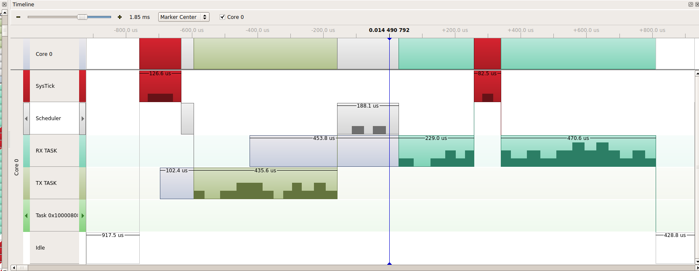

### Description

Tasks exchangind data over the queue

### Structure

- `bsp/config` - platform-specific make file
- `bsp/stm32f4xx` - board-specific files
- `scripts` - contains bash script to create build
- `src/main.c` - applcation code
- `src/mFreeRTOSConfig.h` - freeRTOS configuration file
- `uSDK` - link to shared SDK
- `makefile` - project main make file

### Set up

Target: NUCLEO-F411RE

### Diagram description

- idle task is running
- systick ISR happen
- scheduler start and switch the context (TX task start: put data into the queue)
- TX task finished and call scheduler 
- scheduler start and switch the context (RX task start: receive data from the queue)
- systick ISR happen
- RX task check the queue, the queue is empty, so RX task goes to block state
- idle task is running

